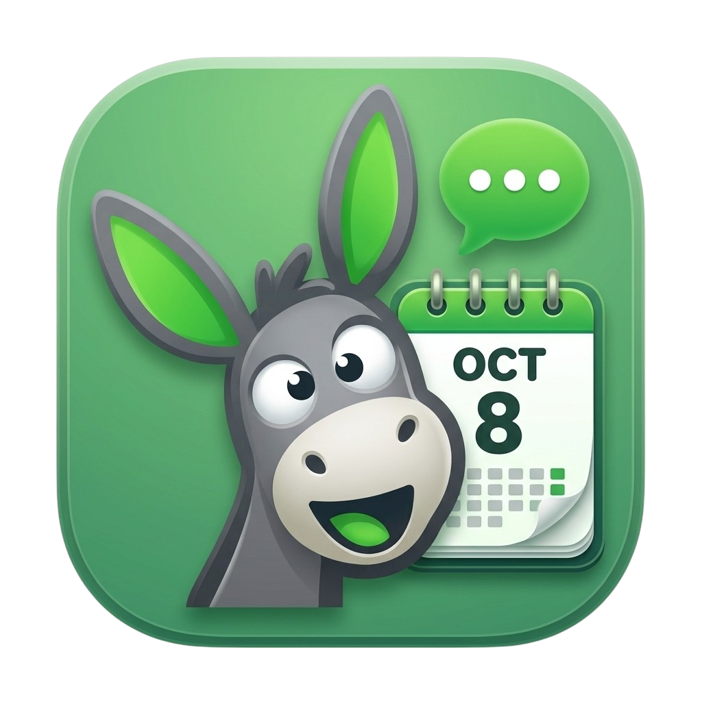

# Donkey Calendar

<p align="center">
  
</p>

<p align="center"><b>Your private AI study calendar.</b></p>

Type what your teacher said — casually, messily — and Donkey Calendar turns it
into calendar events with reminders. Snap a photo of an exam timetable and it
extracts every exam for your confirmation.

## Features

- **AI deadline capture** — natural-language text ("mam said leetcode problems on 9th") becomes a calendar event via structured tool calls
- **Timetable photo extraction** — snap an exam schedule, preview the extracted events, confirm to save
- **Auto-categories** — Academic, Coding, Exam, Assignment, Personal, Other with color-coded cards
- **Local-first storage** — events live in an on-device Drift/SQLite database, no cloud sync
- **Proactive reminders** — local notifications (9 AM day-before for all-day, 1 hour before timed events)
- **Custom calendar** — month grid with event dots, day agenda, manual add/edit/complete/delete
- **Multi-model AI** — switch models from Settings; vision-capable bots handle images
- **Light green theme** — fresh pastel UI, separate identity from Donkey Chat

## Project structure

```
lib/
  main.dart               App shell: auth, 3-tab nav (Home / Calendar / Settings)
  theme.dart              Light green theme + category styles
  db/                     Drift database (schema v2) + CalendarEvents table
  models/                 BotModel, ChatMessage
  services/
    api_service.dart      Donkey Chat backend client (auth, bots, streaming)
    calendar_repository.dart  Event CRUD
    calendar_prompt_builder.dart  Hidden calendar system prompt
    tool_call_parser.dart AI <tool_call> XML/JSON parsing
    calendar_tool_executor.dart  create_event / create_events_batch
    reminder_scheduler.dart Local notifications
    storage_service.dart  Prefs (last bot, default reminder)
  screens/
    home_screen.dart      Week strip, event cards, AI capture bar
    ai_chat_screen.dart   Keyboard-first AI assistant
    calendar_screen.dart  Month calendar + agenda
    event_edit_screen.dart Manual add/edit with category picker
    settings_screen.dart  Model selector, reminders, privacy, clear data
  widgets/                EventCard, EventPreviewCard
```

## Build

```bash
flutter pub get
dart run build_runner build   # regenerate Drift code after schema changes
flutter analyze
flutter build apk --release   # build/app/outputs/flutter-apk/app-release.apk
```

> **Note:** `lib/services/api_service.dart` contains embedded backend
> credentials. Rotate them before distributing a public build.

## Release

Download the latest APK from
[GitHub Releases](https://github.com/yousufalikhan395-lgtm/donkey-calendar/releases).
